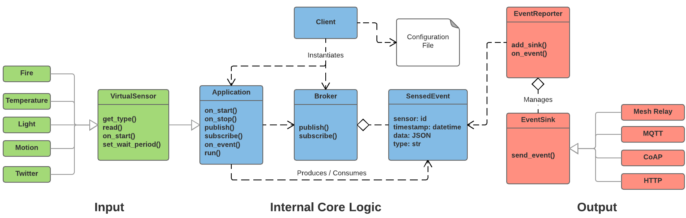

# SCALE Client Architectural Overview

The original SCALE project was built around the concept of loosely-coupled components interacting via a pub-sub broker that handles
exchanging `SensedEvent`s and other messages between the source that creates them and the interested entities that subscribe to them.
This decoupled architecture allowed us to develop parts of the system in isolation, easily replicate them to new sites, and 
cleanly introduce new functionality without modifying the original core.

## Introducing the Main Classes in SCALE Client

The SCALE client recursively adopts this same approach by organizing the runtime environment as shown in the class diagram figure below.
The client's core consists of `Application`s that produce and consume `SensedEvent`s that are routed to interested subscribers
through a `Broker`.
`SensedEvent`s represent the core data object, containing the raw data and associated metadata representing a sensor reading.
`VirtualSensor`s are basically `Application`s that periodically read data from some source, produce a `SensedEvent` that captures this data,
and internally publish this data.
A `PhysicalSensor` is just a `VirtualSensor` that explicitly and directly manages a physical sensing device attached to the client node.
The `EventReporter` inspects all `SensedEvent`s that flow through the `Broker` and chooses how to handle the event:
whether or not it should be published externally and which `EventSink`(s) to publish it via.
See the source code files containing these files for further documentation about how their APIs and implementations work.




## Inheritance in the SCALE Client

Note the liberal (ab)use of object inheritance in the SCALE client including the use of abstract base classes.
Most classes derive from `Application` with the notable exception of the core `ScaleClient` that drives everything.
A `VirtualSensor` is basically just an `Application` that periodically reads sensor data to create a `SensedEvent`.
While we could have chosen a different approach, we believed that this object-orientation would make the SCALE Client
more accessible to individuals with only basic programming experience.
It proved quite powerful as we were able to rapidly develop the initial client and extend it with new functionality as a team
that worked in different physical locations and even time zones.

We chose this approach in order to allow end users to write only a few lines of code in order to modify existing modules
or add new ones that behave similarly to existing ones (see [Modifying Documentation](MODIFYING.md) for details on how to do this).
A user only needs to extend an existing module (e.g. `AnalogPhysicalSensor`) and override a few methods that
handle the specific implementation details of the new module (e.g. the `read_raw()` method that actually reads data from the device).
This allows us to logically separate implementation details into multiple class files
and swap one functionality out for another (e.g. writing a new base `Application` module to run a single asynchronous thread
rather than busy waiting during long operations).


## Data Model

The `SensedEvent` class abstractly represents almost all data in the SCALE Client.
It mainly contains the raw data value, an event type, a priority associated with it, and a timestamp it was created at.
It also contains a URI string (see [URI section below](#uris-in-scale)) referencing the source of the event: a `VirtualSensor` or `Application` instance (NOTE: this is new in SCALE 3.0 and not yet reflected in the below schema where it used to be the sensor device hardware info!).
The raw data value is formatted in JSON and is currently assumed to follow the SCALE SensedEvent Schema:

```json
{"d":
    {"event": "SensedEvent, sensor, or analytics type",
     "value" : "raw data value",
     "units" : "optionally describes the units the value is formatted in",
     "timestamp" : "time event occured in Unix epoch format",
     "device" : {"info about the sensor device that created this event including
                 potentially ID, name, model, version, manufacturer, chipset, etc.
                 NOTE: this info is typically populated from the config file."},
     "location" : "lat/lon, building floor, human readable description, etc.",
     "cond" : {"indicates data values on which condition is raised that caused this event to be published"},
     "prio_value": "in range 0-10; 1- high prio, 5- medium prio, 10-low prio",
     "prio_class":  "low, medium, high event priority",
     "schema" : "URI reference to this schema",
     "misc" : {"description" : "any other event specific info"}
   }
}
```

As a concrete example, consider the following:

```json
{"d" :
    {"event" : "temperature",
     "value" : 55.5,
     "units" : "celsius",
     "timestamp" : 12345678,
     "device" : {"id" : "1",
                 "type" : "TemperatureSensor",
                 "version" : "1.0",
                },
     "location" : {"lat" : 33.3, "lon" : "-71"},
     "cond" : {"threshold" : {"operator" : ">", "value" : "95"},
     "prio_class":  "low",
     "prio_value": 2,
     "schema" : "www.schema.org/scale_sensors.1.0.whatever",
   }
}
```


### Previous Data Schemas

The original SCALE 1.0-2.0 schema followed the above format.  By the SCALE 3.0 release, we expect to have a newer schema that saves some repetition/overhead in each published event  and changes some names to reflect the newer APIs.  In particular, it removes the outer "d", the "prio_class", and changes the field names in the following manner:

* event --> event_type
* value --> data (this could be a more complex object such as a dict)
* device --> source (this is now a URI referring to the `Application` instance that made it, which can eventually be used to look up the referred `PhysicalSensor`'s `DeviceDescriptor` entry in order to glean that hardware information.)
* cond --> condition


### Potential Future Enhancements

In the future, we plan to relax this JSON assumption and allow for other data formats and schemas.
A user could easily do this currently, but a few hacks still exist that make such a transition less clean than it could be.
Furthermore, we are also exploring the option of using object inheritance for `SensedEvent`s too.
This could allow users to write their own types that handle e.g. formatting differently.
As an example, one might wish to treat all *fire*-related data with a higher priority and always publish it externally on a
different channel (`EventSink`).
After writing the base class for this `FireEvent` they can then build on it with `HighHeatEvent`, `SmokeEvent`, and `FlameEvent`.
We have not found this approach necessary in practice and so defer to others to determine whether it would be useful.


## URIs in SCALE

New in SCALE 3.0, the SCALE Client adopted the commonly-used practice of using URIs to reference logical entities in the system.  Every scale_client runtime component (i.e. deriving from `Application`) has a `.path` attribute that returns this URI.    The following is a current (tentative) schema for the default `path`s you may see:

`SCHEME:[//NET_ID]/scale/(sensors|devices|applications|networks|events)/NAME`

Where NAME is typically the `Application.name` attribute;
SCHEME is (currently) `scale-local` when referring to a local entity, in which case it will have no NET_ID;
NET_ID is of the form `//[username[:password]]ip.add.re.ss[:port]` when referring to an external (i.e. network) entity, in which case SCHEME will be the protocol used to communicate with it e.g. mqtt, coap, http, etc.

Note that the root of the URI path (i.e. 'scale') is the default namespace in the scale client.  The URI manipulation API explicitly exposes this namespace concept so as to distinguish URIs managed by the SCALE core from those that users may wish to define in their own namespace in order to implement very different logic for.
 
In an attempt to maintain RFC 3986 compliance and limit development bugs, the `scale_client.util.uri` package leverages the third-party Python library `uritools`.


## The SCALE Client Underlying Runtime

By inspecting the source code of the `Application` and `Broker` classes, one will note that SCALE adopts an abstract base class pattern
for its underlying runtime in order to easily integrate additional ones in the future.
The actual concrete implementation of `Application` is currently set at the end of the file to be the default imlementation,
which uses the Python [Circuits framework](http://circuitsframework.com/) to accomplish asynchronous event-handling.
Some limitations of this framework and current implementation include:
* `scale_client` currently does not fully support subscribing to events locally
* Running long blocking operations requires the use of a `ThreadedApplication` or `ThreadedVirtualSensor`.  This
introduces more overhead than a single thread due to the manner in which Circuits creates a pool of workers.


## Backwards Compatibility

Because SCALE underwent several iterations over the years, we made an effort to maintain backwards compatibility.  Note that this does not always work and is not well tested.  Our main effort in this regard was to maintain compatibility for the various `SensedEvent` schemas so as not to crash older clients or render their exported data useless.
  
You'll notice most of the hacks to accomplish this backwards compatibility in the `SensedEvent` class (i.e. its encoding/decoding methods) as well as for some constructors i.e. `VirtualSensor`.